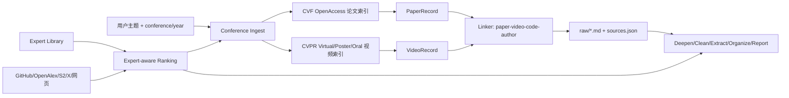

# research-tool 后续优化计划：CVPR 论文/YouTube 视频与专家库

> 生成日期：2026-07-08
> 面向项目：`research-tool` v0.1.1
> 当前目标：先形成可评审的详细优化计划，不进入代码实施
> 用户给定优化方向：
> 1. CVPR 论文及对应的 YouTube 视频；
> 2. 建立专家库，避免低 star 但高质量的专家/实验室/项目被 GitHub star 排序淹没，例如 `facebookresearch/vggt-omega`。

---

## 0. 外部依据与当前项目判断

### 0.1 已核验的外部事实

- CVPR 2026 官方页面显示会议时间为 2026-06-03 至 2026-06-07，地点为 Colorado Convention Center；官方同时提供 `Virtual Content and Live Streams` 入口，并说明录播会在可用后发布到会议网站。
  参考：[CVPR 2026 Conference](https://cvpr.thecvf.com/Conferences/2026)
- CVF Open Access 已有 CVPR 2026 论文入口，并按 Day 1/2/3 与 All Papers 组织论文页面。
  参考：[CVPR 2026 Open Access Repository](https://openaccess.thecvf.com/CVPR2026)
- CVPR 2026 的作者上传说明明确主会 poster 页面需要挂 5 分钟 YouTube 视频；Oral 论文的 poster 页视频会自动出现在 oral 页。也就是说，“论文页/Poster 页/Oral 页/YouTube 视频”的链接关系是官方流程的一部分，但部分内容可能受会议网站或区域访问限制影响。
  参考：[YouTube Video and Poster Uploads](https://cvpr.thecvf.com/Conferences/2026/YouTubeVideoPosterUpload)
- 用户给出的 `facebookresearch/vggt-omega` 已核验为公开 GitHub 仓库，页面标注 `[CVPR 2026 Oral] VGGT Omega`，当前可见约 3.4k stars、184 forks，并包含论文、模型、Demo、Hugging Face checkpoint 访问等信息。
  参考：[facebookresearch/vggt-omega](https://github.com/facebookresearch/vggt-omega)

### 0.2 对当前项目的落点判断

当前项目已有：

- `Collect -> Deepen -> Clean -> Extract -> Organize -> Report` 六阶段管道；
- GitHub / OpenAlex / Crossref / arXiv / Semantic Scholar / Bilibili / X 等 12 个搜索后端；
- YouTube + Bilibili 的 `VideoIngest` 能力，能把视频下载、转写、总结后写入 `raw/`，再复用下游 5 阶段；
- `collector.extra_queries`、`core_keyword`、`facets`、`deep_search`、`from_year/to_year`、`relevance_filter`、`backward loop` 等反偏差机制。

因此，本轮优化不应另建一套孤立系统。建议把新增能力做成两个可插拔增强：

1. `Conference Ingest`：让 CVPR 论文、Poster/Oral 页面、YouTube 视频、项目页、代码仓库进入现有 `raw/ + sources.json` 契约。
2. `Expert Library`：给 Collect/Deepen/GitHub 排名提供专家、实验室、论文作者、可信项目的质量先验，降低 star 排序偏差。

---

## 1. 总体目标

### 1.1 产品目标

让用户输入类似：

```bash
research run "CVPR 2026 feed-forward 3D reconstruction" \
  --conference cvpr \
  --conference-year 2026 \
  --with-videos \
  -s openalex -s github
```

系统能够自动：

1. 收集 CVPR 对应年份的相关论文；
2. 匹配官方 Poster/Oral 页与 YouTube 视频；
3. 将视频转写与总结结果作为正式证据进入 `raw/`；
4. 找到论文关联代码、项目页、作者主页、实验室主页；
5. 用专家库提升低 star 但高可信项目的排序；
6. 在最终知识树/报告中给出“论文-视频-代码-专家/实验室”证据链。

### 1.2 非目标

- 不做通用会议平台大而全爬虫，第一期只针对 CVPR/CVF Open Access 与 CVPR 官方会议站。
- 不绕过登录、付费墙、区域限制或会议注册限制；遇到受限视频只登记元数据与失败原因。
- 不以 star 数替代质量判断，也不把专家库变成永久硬编码白名单。
- 不在第一期引入数据库服务。继续坚持本项目的文件系统通信与可恢复调试原则。

---

## 2. 方案总览

### 2.1 新增能力图



### 2.2 模块拆分

| 模块 | 层级 | 职责 |
|---|---|---|
| `domain/models.py` 新增会议/专家模型 | domain | 定义 `ConferencePaper`、`ConferenceVideo`、`ExpertProfile`、`RepoQualitySignal` 等稳定契约 |
| `infrastructure/search/cvpr_openaccess.py` | infrastructure | 抓取/解析 CVF Open Access 论文索引 |
| `infrastructure/search/cvpr_virtual.py` | infrastructure | 抓取/解析 CVPR Virtual/Video/Poster/Oral 页 |
| `infrastructure/knowledge/expert_library.py` | infrastructure | 读写专家库 YAML/JSON，校验证据与可信等级 |
| `infrastructure/knowledge/repo_ranker.py` | infrastructure | 计算 repo 质量分，弱化 star 单因子 |
| `application/conference_pipeline.py` | application | 编排论文、视频、代码、专家链接，输出到 `raw/` |
| `presentation/cli.py` | presentation | 暴露 `--conference/--conference-year/--with-videos` 与专家库管理命令 |
| `presentation/webui.py` | presentation | 在 Web UI 增加会议和专家库选项，第二期再做 |

---

## 3. 方向一：CVPR 论文及对应 YouTube 视频

### 3.1 用户故事

1. 作为调研者，我希望输入某个主题和 CVPR 年份，系统能优先检索该年份 CVPR 论文，而不是被普通网页结果稀释。
2. 作为调研者，我希望同一篇论文的 PDF、poster/oral 页面、YouTube 视频、项目页、代码仓库能聚合成一条证据链。
3. 作为调研者，我希望视频内容不仅作为链接出现，还能被转写、分章、总结，并参与最终知识树。
4. 作为调研者，我希望系统告诉我哪些视频无法访问、哪些论文没有匹配视频，而不是静默漏掉。

### 3.2 数据模型建议

新增或扩展 Pydantic 模型：

```python
class ConferencePaper(BaseModel):
    conference: Literal["cvpr"]
    year: int
    title: str
    authors: list[str] = []
    abstract: str = ""
    pdf_url: str | None = None
    html_url: str | None = None
    supplement_url: str | None = None
    project_url: str | None = None
    code_urls: list[str] = []
    session: str | None = None
    presentation_type: Literal["poster", "oral", "highlight", "unknown"] = "unknown"
    source_url: str


class ConferenceVideo(BaseModel):
    conference: Literal["cvpr"]
    year: int
    title: str
    paper_title: str | None = None
    authors: list[str] = []
    page_url: str
    youtube_url: str | None = None
    youtube_id: str | None = None
    duration_sec: int | None = None
    access_status: Literal["public", "gated", "missing", "failed", "unknown"] = "unknown"


class PaperBundle(BaseModel):
    paper: ConferencePaper
    videos: list[ConferenceVideo] = []
    code_urls: list[str] = []
    project_urls: list[str] = []
    expert_ids: list[str] = []
    match_confidence: float = 0.0
```

说明：

- `PaperBundle` 是会议增强的核心单位，用于生成一份 raw Markdown；
- 不强制所有字段第一期全量可得，必须保留 `access_status` 和 `match_confidence`；
- 该模型应仅表达领域事实，爬取与匹配逻辑放在 infrastructure/application。

### 3.3 CVPR 论文采集

#### 3.3.1 P0：CVF Open Access 解析

输入：

- `conference=cvpr`
- `year=2024/2025/2026`
- `topic`
- 可选：`presentation_type`、`max_papers`、`from_year/to_year`

处理：

1. 打开 `https://openaccess.thecvf.com/CVPR{year}`；
2. 优先解析 `All Papers`，失败时按 Day 页面回退；
3. 抽取 title、authors、paper HTML、PDF、supplement；
4. 对 title + abstract 做轻量主题相关性过滤；
5. 对命中论文写入 `conference_index.json` 缓存。

输出：

- `work_dir/<topic>/conference/cvpr_<year>_papers.json`
- 每篇命中论文对应一个 `raw/cvpr_<year>_<slug>.md`
- `sources.json` 中新增 `source_engine="cvpr_openaccess"` 的记录

#### 3.3.2 P1：CVPR Virtual/Video 页面解析

输入：

- `ConferencePaper` 列表
- CVPR 年份

处理：

1. 抓取 `https://cvpr.thecvf.com/Conferences/{year}/Videos`；
2. 解析 poster/oral/keynote 等视频页面链接；
3. 对每个视频页抽取 title、authors、event 类型、YouTube URL 或嵌入 ID；
4. 通过 title 归一化、作者重叠、页面 ID 做论文匹配；
5. 如果视频页只对注册用户可见，记录 `access_status="gated"`；
6. 如果视频缺失，记录 `access_status="missing"`，不阻塞论文采集。

匹配规则：

| 信号 | 权重 | 说明 |
|---|---:|---|
| 标题完全归一化相同 | 0.55 | 去大小写、标点、希腊字母与 Unicode 变体 |
| 作者集合 Jaccard | 0.25 | 允许作者缩写和顺序差异 |
| 页面 URL/论文 ID | 0.15 | 如果能拿到官方 ID，优先使用 |
| presentation type 一致 | 0.05 | Oral/Poster 辅助判断 |

`match_confidence >= 0.75` 自动关联；`0.55-0.75` 写入待审核清单；低于 0.55 不关联。

#### 3.3.3 P1：YouTube 视频进入现有 VideoIngest

对匹配到 `youtube_url` 的视频：

1. 复用现有 `validate_video_url()` 和 `VideoPipeline`；
2. 写入 `raw/video_<id>.md`；
3. 在 front matter 中补充会议字段，例如：

```yaml
video_conference: cvpr
video_conference_year: 2026
video_paper_title: "VGGT-Ω"
video_presentation_type: oral
video_match_confidence: 0.93
```

4. 在 `PaperBundle` 的 raw 文档中交叉引用视频 raw 文件路径；
5. 视频下载/转写失败时不中断整篇论文采集，只把失败写入 `conference_video_failures.json`。

#### 3.3.4 P2：项目页与代码仓库链接

代码链接来源：

- OpenAccess 论文 HTML 页正文；
- PDF 第一页或附录中的 URL；
- 作者项目页；
- GitHub 搜索后端；
- repo README 中的论文标题/arXiv/CVF 链接反查；
- 专家库中的已知 repo seeds。

第一期建议只做：

1. 从 OpenAccess HTML/PDF 页面提取 URL；
2. 识别 GitHub/Hugging Face/project page；
3. 用论文标题 + 第一作者 + 方法名做 GitHub 补搜；
4. 用 `repo_ranker` 排序，不再只按 stars。

### 3.4 输出文件规范

建议新增目录：

```text
research-output/<topic>/
├── raw/
│   ├── cvpr_2026_vggt_omega.md
│   └── video_<youtube_id>.md
├── conference/
│   ├── cvpr_2026_papers.json
│   ├── cvpr_2026_videos.json
│   ├── paper_video_links.json
│   ├── code_links.json
│   └── conference_video_failures.json
├── sources.json
└── ...
```

`raw/cvpr_2026_*.md` 模板：

```markdown
---
source_type: conference_paper
conference: cvpr
conference_year: 2026
presentation_type: oral
paper_title: VGGT-Ω
paper_pdf_url: ...
paper_html_url: ...
video_urls:
  - ...
code_urls:
  - https://github.com/facebookresearch/vggt-omega
match_confidence: 0.93
---

# VGGT-Ω

## 摘要
...

## 论文-视频-代码证据链
- Paper: ...
- Video: ...
- Code: ...

## 与主题的相关性
...
```

### 3.5 CLI/API 设计

第一期 CLI：

```bash
research collect "3D reconstruction" \
  --conference cvpr \
  --conference-year 2026 \
  --with-videos \
  --max-conference-papers 50

research run "VGGT Omega" \
  --conference cvpr \
  --conference-year 2026 \
  --with-videos \
  --core "VGGT Omega" \
  -s github -s openalex
```

配置：

```yaml
conference:
  enabled: true
  name: cvpr
  years: [2026]
  with_videos: true
  with_code_links: true
  max_papers: 80
  min_topic_relevance: 0.18
  video_match_threshold: 0.75
  video_ingest:
    enabled: true
    max_videos: 20
    transcribe: true
```

SDK：

```python
research(
    "feed-forward 3D reconstruction",
    conference={"name": "cvpr", "year": 2026, "with_videos": True},
)
```

### 3.6 验收标准

- 给定 `conference=cvpr, year=2026`，能成功生成 `conference/cvpr_2026_papers.json`。
- 对至少 20 篇主题相关论文，能生成 raw Markdown，并写入 `sources.json`。
- 对公开视频，能调用现有 VideoIngest 生成 `video_*.md`。
- 对 gated/missing/failed 视频，能生成失败清单，不中断管道。
- 同一论文的 paper/video/code 链接可在最终 report 中被引用。
- 所有新增网络解析测试使用本地 HTML fixture，不依赖实时外网。

---

## 4. 方向二：专家库与反 star 偏差排名

### 4.1 问题定义

当前 `GitHubBackend` 通过 GitHub Search API 搜仓库，并使用：

```python
"sort": "stars",
"order": "desc"
```

这适合找大众热门项目，但会漏掉：

- 新论文刚发布，star 还没积累；
- 小领域专家代码，用户少但质量高；
- 实验室/作者维护的官方 repo；
- 作者主页或项目页指向的仓库，名字不一定能被普通关键词搜到；
- star 不高但直接对应 CVPR/ICCV/ECCV/NeurIPS 等顶会论文的实现。

用户给出的 `facebookresearch/vggt-omega` 是典型提醒：不能只看 star，应该看“论文来源、作者/机构可信度、项目与论文的直接关联、模型/数据/文档完整性、发布时间与领域热度”等综合信号。

### 4.2 专家库定位

专家库不是“强行置顶名单”，而是一个有证据、有置信度、可审计的质量先验系统。

它应该回答：

1. 某个主题有哪些核心专家、实验室、组织、作者主页？
2. 某个 repo 是否由论文作者/实验室/组织维护？
3. 某个 repo 即使 star 低，是否应进入候选集合？
4. 这次调研里，哪些结果是因为专家库提升而被保留？
5. 专家库自身有没有陈旧、偏见、误配、过拟合？

### 4.3 数据模型建议

```python
class ExpertProfile(BaseModel):
    expert_id: str
    name: str
    aliases: list[str] = []
    affiliations: list[str] = []
    fields: list[str] = []
    homepage: str | None = None
    scholar_url: str | None = None
    dblp_url: str | None = None
    github_users: list[str] = []
    organizations: list[str] = []
    evidence_urls: list[str] = []
    confidence: float = 0.0
    status: Literal["candidate", "trusted", "deprecated"] = "candidate"
    updated_at: str


class RepoSeed(BaseModel):
    repo_url: str
    topics: list[str] = []
    related_papers: list[str] = []
    related_experts: list[str] = []
    source: Literal["manual", "conference", "project_page", "github", "llm_suggested"]
    evidence_urls: list[str] = []
    quality_prior: float = 0.5
    status: Literal["candidate", "trusted", "rejected", "deprecated"] = "candidate"
    notes: str = ""


class RepoQualitySignal(BaseModel):
    repo_url: str
    relevance_score: float
    expert_affinity: float
    paper_link_score: float
    freshness_score: float
    maintenance_score: float
    documentation_score: float
    popularity_score: float
    license_score: float
    final_score: float
    reasons: list[str] = []
```

### 4.4 存储方案

第一期使用文件系统，保持项目风格：

```text
data/
└── expert_library/
    ├── experts/
    │   ├── 3d_vision.yaml
    │   └── vision_language.yaml
    ├── repos/
    │   ├── 3d_reconstruction.yaml
    │   └── multimodal.yaml
    ├── organizations.yaml
    └── audit/
        └── expert_library_audit_20260708.md
```

可选用户级覆盖：

```text
~/.research/expert_library/
```

合并优先级：

1. 用户本地 `~/.research/expert_library/`；
2. 项目内 `data/expert_library/`；
3. 运行时从 CVPR/项目页发现的 candidate；
4. LLM 建议仅进入 candidate，不直接 trusted。

### 4.5 排名策略

GitHub repo 排名从单一 star 排序改为多信号融合。

建议公式：

```text
final_score =
  0.24 * relevance_score
+ 0.20 * paper_link_score
+ 0.18 * expert_affinity
+ 0.12 * documentation_score
+ 0.10 * freshness_score
+ 0.08 * maintenance_score
+ 0.05 * popularity_score
+ 0.03 * license_score
```

关键点：

- `popularity_score` 使用 `log1p(stars)` 并按 repo 年龄归一化，避免老项目天然碾压新项目；
- `paper_link_score` 直接识别 README/项目页/论文页互链；
- `expert_affinity` 来自专家库，不允许单独决定最终入选，必须有证据 URL；
- `trusted RepoSeed` 拥有候选保底名额，但仍经过主题相关性过滤；
- `candidate` 只提升召回，不提升最终结论置信度。

### 4.6 专家库接入 Collect/Deepen

#### Collect 阶段

1. 在构造 queries 时，加入专家库的 aliases、实验室名、方法名、repo 名；
2. 在 GitHub 搜索前，先注入 `RepoSeed` 直接 URL；
3. 搜索返回后，用 `repo_ranker` 重排；
4. `sources.json` 记录 `expert_boosted=true/false` 和 boost 原因。

#### Deepen 阶段

1. 对主题画像加入专家、机构、论文线索；
2. gap detection 发现“只有论文没有代码”时，优先查 expert library；
3. 同名消歧时，专家主页/机构/论文领域作为辅助信号；
4. 反向循环发现知识树稀疏节点时，生成专家/实验室定向查询。

#### Report 阶段

报告中增加可选小节：

```markdown
## 专家与高质量代码线索

| 主题 | 专家/实验室 | 论文 | 代码 | 为什么被推荐 |
|---|---|---|---|---|
```

### 4.7 专家库维护命令

```bash
research expert add --name "Andrea Vedaldi" \
  --field "3D vision" \
  --affiliation "University of Oxford" \
  --github-org facebookresearch \
  --evidence-url "https://github.com/facebookresearch/vggt-omega"

research expert import --from-conference cvpr --year 2026 --topic "3D reconstruction"

research expert audit --topic "3D reconstruction"

research expert repo add https://github.com/facebookresearch/vggt-omega \
  --topic "feed-forward 3D reconstruction" \
  --paper "VGGT-Ω" \
  --status trusted
```

### 4.8 `vggt-omega` 示例入库草案

```yaml
- repo_url: "https://github.com/facebookresearch/vggt-omega"
  topics:
    - "feed-forward 3D reconstruction"
    - "visual geometry"
    - "multi-view depth"
    - "camera estimation"
  related_papers:
    - "VGGT-Ω"
  related_experts:
    - "jianyuan_wang"
    - "andrea_vedaldi"
    - "christian_rupprecht"
  source: "manual"
  evidence_urls:
    - "https://github.com/facebookresearch/vggt-omega"
    - "https://arxiv.org/abs/2605.15195"
  quality_prior: 0.88
  status: "trusted"
  notes: "GitHub 页面标注 CVPR 2026 Oral；由 Meta AI / Oxford VGG 相关作者维护，适合作为 3D vision 主题的高质量种子。"
```

### 4.9 验收标准

- GitHub 搜索仍保留 star 信息，但最终排序不再等同于 star 排序。
- 给定一个 expert seed，即使 repo star 低，也能进入候选集并记录提升原因。
- 对每个被专家库提升的 repo，输出可审计 `reasons`。
- 没有证据 URL 的专家/仓库只能作为 candidate，不能 trusted。
- 专家库 YAML schema 有单元测试、重复检测、坏 URL 检测。
- 外部网络不可用时，专家库本地 seeds 仍能工作。

---

## 5. 分阶段实施计划

### Phase 0：评审与范围冻结

预计：0.5 天

产出：

- 本文档经用户审核；
- 决定第一期支持的 CVPR 年份：建议从 2026 开始，兼容 2025；
- 决定视频范围：建议只做 CVPR 官方 poster/oral 页面挂载的 YouTube；
- 决定专家库初始领域：建议先做 3D vision / visual geometry。

门禁：

- 用户确认 CLI 形态；
- 用户确认专家库是否允许项目内置种子数据。

### Phase 1：模型、配置与 fixture

预计：1-2 天

任务：

1. 在 `domain/models.py` 增加会议与专家模型；
2. 在 `docs/config.example.yaml` 增加 `conference:` 与 `expert_library:` 配置；
3. 新增本地 HTML fixture：CVF OpenAccess 页面、CVPR Videos 页面、GitHub repo 页片段；
4. 新增 schema 校验测试。

测试：

```bash
pytest research_tool/tests/test_config.py \
       research_tool/tests/test_conference_models.py \
       research_tool/tests/test_expert_library_schema.py -v
```

### Phase 2：CVF OpenAccess 后端

预计：2 天

任务：

1. 新增 `cvpr_openaccess.py`；
2. 解析 CVPR 年份页、All Papers、论文 HTML；
3. 输出 `ConferencePaper`；
4. 接入 Collector 或 `ConferencePipeline`；
5. 添加缓存与限流。

测试：

- fixture 解析测试；
- 网络失败降级测试；
- 主题相关性过滤测试；
- `sources.json` 契约测试。

### Phase 3：CVPR 视频链接器与 VideoIngest 复用

预计：3-4 天

任务：

1. 新增 `cvpr_virtual.py`；
2. 解析 videos/poster/oral 页面；
3. 实现 paper-video fuzzy linker；
4. 对公开视频调用现有 VideoIngest；
5. 生成 `paper_video_links.json` 与 `conference_video_failures.json`。

测试：

- 标题归一化测试，包括 Unicode `Ω` 与 `Omega`；
- 作者匹配测试；
- gated/missing/failed 视频测试；
- VideoIngest mock 测试，避免单测下载真实视频。

### Phase 4：专家库 MVP

预计：3 天

任务：

1. 新增 `infrastructure/knowledge/expert_library.py`；
2. 支持 YAML 读写、合并、去重、状态校验；
3. 新增 `RepoSeed` 直接注入 Collect；
4. 新增 `expert audit` 输出；
5. 添加 `vggt-omega` 作为示例 seed，先放在文档或测试 fixture，是否内置进入 `data/` 等用户确认。

测试：

- YAML schema 校验；
- 重复 expert/repo 检测；
- candidate/trusted 状态约束；
- 用户级目录覆盖项目默认目录。

### Phase 5：Repo 多信号排名

预计：2-3 天

任务：

1. 新增 `repo_ranker.py`；
2. GitHubBackend 支持 `sort=best-match/stars/updated` 或多排序召回；
3. 对候选 repo 计算 `RepoQualitySignal`；
4. 在 `sources.json` 或 companion JSON 中记录 ranking reasons；
5. Clean/Report 可读取这些 reasons。

测试：

- star 高但无关 repo 被降权；
- star 低但 paper/expert 证据强 repo 被保留；
- ranking reasons 可序列化；
- 无 GitHub token 时仍能用本地 seeds。

### Phase 6：端到端集成与文档

预计：2-3 天

任务：

1. CLI 接线；
2. README 增加 CVPR/专家库使用示例；
3. Web UI 仅加最小开关或暂列下一期；
4. 增加 smoke 脚本：

```bash
research run "VGGT Omega" \
  --conference cvpr \
  --conference-year 2026 \
  --with-videos \
  --skip extract
```

验收：

```bash
ruff check .
pytest research_tool/tests -v
```

---

## 6. 风险与缓解

| 风险 | 影响 | 缓解 |
|---|---|---|
| CVPR 官方页面结构变化 | 解析失效 | 使用 fixture + 多选择器解析；失败时保留 HTML 快照；将解析器做成按 year 可替换 |
| 视频受注册/区域限制 | 无法转写 | 标记 `gated`，不中断论文管道；允许用户手动传 YouTube URL 或本地视频 |
| YouTube 下载失败 | 视频 raw 缺失 | 复用现有错误码体系；失败写入 `conference_video_failures.json` |
| paper-video 误匹配 | 报告引用错证据 | 置信度阈值 + 待审核列表；低置信度不自动进入最终证据链 |
| 专家库引入偏见 | 过度偏向已知实验室 | candidate/trusted 分级；必须记录 evidence；报告专家提升原因 |
| star 降权过度 | 漏掉成熟项目 | star 仍保留 5% 权重，并作为召回排序之一 |
| LLM 成本上升 | 运行慢且贵 | 会议解析、链接、repo 排名尽量规则化；LLM 只用于摘要和少量消歧 |
| 代码跨层污染 | 破坏 01-架构 | CLI 只传参；编排在 application；解析和排名在 infrastructure；模型在 domain |

---

## 7. 自审核

### 7.1 架构自检

| 检查项 | 结论 | 说明 |
|---|---|---|
| 是否遵守现有六阶段管道 | 通过 | 新能力把会议论文/视频/专家 seed 写入 `raw/` 和 companion JSON，下游仍复用 Clean/Extract/Organize/Report |
| 是否新增不必要服务 | 通过 | 第一阶段不用数据库，不引入后台服务 |
| 是否避免表现层承载业务逻辑 | 通过但需警惕 | CLI 只做参数透传，核心编排放 `application/conference_pipeline.py` |
| 是否能中断恢复 | 通过 | conference JSON、video failures、ranking signals 均落盘 |
| 是否影响现有用户默认行为 | 通过 | `conference.enabled=false`、`expert_library.enabled=false` 时行为不变 |

### 7.2 测试自检

| 检查项 | 结论 | 需要补强 |
|---|---|---|
| 网络解析可测 | 通过 | 必须使用 HTML fixture，避免 CI 依赖外网 |
| 视频管道可测 | 通过 | 单测 mock VideoIngest，端到端 smoke 可选真实 URL |
| 排名可测 | 通过 | 构造高 star 低相关、低 star 高证据样例 |
| 专家库可审计 | 通过 | 每次 expert boost 必须输出 reasons |
| 回归风险 | 中 | GitHubBackend 当前默认 star 排序，重排逻辑要保持兼容开关 |

### 7.3 用户价值自检

| 用户诉求 | 覆盖情况 |
|---|---|
| CVPR 及对应 YouTube 视频 | 已拆为 CVF OpenAccess、CVPR Videos、paper-video linker、VideoIngest 复用 |
| 建立专家库 | 已拆为 ExpertProfile、RepoSeed、RepoQualitySignal、audit 命令 |
| 避免低 star 高质量项目被覆盖 | 已设计 expert seed 保底召回 + 多信号排名 |
| 以 `vggt-omega` 为例 | 已给出入库草案与证据链策略 |
| 先计划再审核 | 本文最后提供待用户审核问题，不进入实施 |

### 7.4 自评结论

综合可行性：高。
主要不确定性：CVPR 视频页的公开程度、YouTube 可访问性、paper-video 页面结构稳定性。
建议实施顺序：先做 CVPR OpenAccess + 专家库 seed/ranking，再接视频转写。这样即使视频受限，论文和 repo 质量提升也能先产生价值。

自评分：

| 维度 | 得分 |
|---|---:|
| 需求覆盖 | 0.93 |
| 架构贴合 | 0.90 |
| 可测试性 | 0.88 |
| 风险识别 | 0.86 |
| 实施颗粒度 | 0.91 |
| 综合 | 0.90 |

---

## 8. 提交给用户审核的问题

请重点确认下面 6 个点：

1. CVPR 年份范围：第一期是否只做 2026，还是同时兼容 2024-2026？
2. 视频范围：是否只采 CVPR 官方 poster/oral 页面挂载的 YouTube，还是也采作者个人频道/项目页视频？
3. 专家库初始领域：是否以 3D vision / visual geometry 作为第一批专家库？
4. 专家库维护方式：是否允许项目内置少量 trusted seeds，还是全部放用户本地 `~/.research/expert_library/`？
5. `vggt-omega` 是否作为第一条 trusted repo seed 入库？
6. 第一阶段是否先不改 Web UI，只交付 CLI + SDK + 文档？

---

## 9. 建议的第一期验收场景

主题：

```text
CVPR 2026 VGGT Omega and feed-forward 3D reconstruction
```

期望输出：

- 至少 1 篇 `VGGT-Ω` 相关 CVPR 论文 raw；
- 至少 1 个 `facebookresearch/vggt-omega` repo 证据；
- 若公开视频可访问，生成对应 `video_*.md`；
- 如果视频不可访问，生成明确 failure record；
- 最终 report 能说明论文、视频、代码、专家/机构之间的关系；
- ranking audit 能说明为什么该 repo 被保留，不仅因为 stars。

---

## 10. 下一步

待用户审核通过后，建议按 Phase 1 开始实施。第一批代码改动应控制在：

- `domain/models.py`
- `research_tool/infrastructure/search/cvpr_openaccess.py`
- `research_tool/infrastructure/knowledge/expert_library.py`
- `research_tool/infrastructure/knowledge/repo_ranker.py`
- `research_tool/application/conference_pipeline.py`
- `research_tool/presentation/cli.py`
- `docs/config.example.yaml`
- 对应 tests

不建议在第一批同时改 Web UI，避免扩大验证面。
