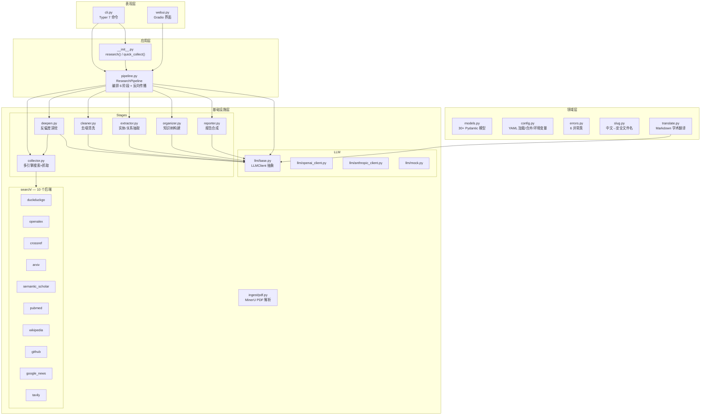
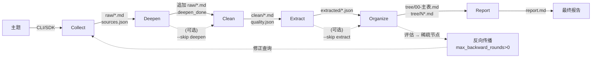

# CODE_MAP — research-tool 代码图谱（给人读）

> 依据 08-代码理解与图谱规范 §三·纯文档退路。  
> Understand-Anything Dashboard 尚未部署时的替代：Mermaid 架构图 + 逐模块调用关系 + 数据流。

---

## 一、架构全景图

---

## 二、逐模块调用关系

### 入口点（表现层）

| 模块 | 对外暴露 | 被谁调用 |
|------|---------|---------|
| `cli.py` | Typer app（7 命令） | 终端 `research` 命令 |
| `webui.py` | `main(port, inbrowser)` | `cli.py:ui` 命令 |
| `__init__.py` | `research()`, `quick_collect()`, 全部公共类 | Python 脚本 / notebook |

### 管道编排（应用层）

| 模块 | 对外暴露 | 被谁调用 | 调用了谁 |
|------|---------|---------|---------|
| `pipeline.py` | `ResearchPipeline.run()` / `.stream()` | cli.py, webui.py, __init__.py | 全部 6 个 Stage + LLMClient + slugify |

### 领域模型

| 模块 | 对外暴露 | 被谁调用 | 外部依赖 |
|------|---------|---------|---------|
| `models.py` | 30+ Config/Result 模型 | 全项目 | `pydantic` |
| `config.py` | `load_config(path, overrides)` | cli.py, __init__.py | `pyyaml` |
| `errors.py` | 6 异常类 | 全项目 | 标准库 |
| `slug.py` | `slugify(text)` | pipeline.py, cli.py | `pypinyin` |
| `translate.py` | `translate_markdown(md, llm)` | ingest/pdf.py | `LLMClient` |

### 六个阶段 — 调用关系

| Stage | 核心方法 | 输入 | 输出 | 调用 |
|-------|---------|------|------|------|
| `Collector` | `run(topic, dir)` / `search_queries()` / `fetch_and_store()` | 搜索查询 | `raw/*.md` + `sources.json` | 10 个搜索后端 + Crawl4AI/httpx |
| `DeepenStage` | `run(topic, raw_dir)` | raw/ | 追加 `raw/*.md` + `.deepen_done` | Collector + LLMClient |
| `Cleaner` | `process(raw_dir)` + `filter_relevance()` | raw/ | `clean/*.md` + `quality.json` | LLMClient（仅相关性过滤） |
| `Extractor` | `run(clean_dir, llm)` | clean/ | `extracted/*.json` | LLMClient |
| `Organizer` | `run(input_dir, llm)` + `assess_and_feedback()` | clean/ 或 extracted/ | `tree/*.md` + feedback | LLMClient |
| `Reporter` | `run(tree_dir, llm, topic)` | tree/ | `report.md` / `report.html` | LLMClient |

### LLM 客户端

| 模块 | 说明 | 被谁调用 |
|------|------|---------|
| `llm/base.py` | 抽象基类 + 工厂（`from_config`映射 provider→具体实现） | pipeline.py, cli.py |
| `llm/openai_client.py` | OpenAI 兼容（含 DeepSeek/Ollama） | 工厂创建 |
| `llm/anthropic_client.py` | Anthropic Claude | 工厂创建 |
| `llm/mock.py` | 测试用 Mock | tests/ |

### 搜索后端（全部实现 `SearchBackend`）

| 模块 | 源 | 需 Key | 特点 |
|------|-----|:---:|------|
| `duckduckgo.py` | DuckDuckGo | 免 | 通用网页 |
| `openalex_backend.py` | OpenAlex | 免 | 2.5 亿+ 全学术 |
| `crossref_backend.py` | Crossref | 免 | 1.5 亿 DOI |
| `arxiv_backend.py` | arXiv | 免 | 预印本 |
| `semantic_scholar.py` | Semantic Scholar | 可选 | 引用数 |
| `pubmed_backend.py` | PubMed | 免 | 生物医学 |
| `wikipedia_backend.py` | Wikipedia | 免 | 中英双站点 |
| `github_backend.py` | GitHub | 可选 | 开源代码 |
| `google_news.py` | Google News | 免 | 最新新闻 |
| `tavily.py` | Tavily | 需 | LLM 优化搜索 |

---

## 三、数据流（六阶段管道）

每个 Stage 仅通过文件系统通信。上一阶段的**输出目录**即下一阶段的**输入目录**。  
已产出目录的阶段在 `--resume` 模式（默认）下自动跳过。

---

## 四、关键设计决策速查

| 决策 | ADR | 要点 |
|------|-----|------|
| 文件系统通信 | 0001 | Stage 间零内存依赖，可中断/恢复/独立调试 |
| LLM 抽象 | — | `LLMClient` 接口 → 工厂创建；不绑定任何 SDK |
| Extractor 可选 | — | 关闭时 Organizer 直接吃 clean/ 文本 |
| 幂等恢复 | — | `has_output()` 检查 → 已产出自动跳过 |
| 单文件 ≤500 行 | — | 当前最大 433 行（deepen.py），其余均 < 400 |

---

## 五、文件规模速览

| 文件 | 行数 | 超 500? |
|------|------|:---:|
| `cli.py` | ~555 | ✅ (Typer 参数声明固有) |
| `deepen.py` | 445 | ❌ |
| `collector.py` | 385 | ❌ |
| `cleaner.py` | 378 | ❌ |
| `webui.py` | ~375 | ❌ |
| `models.py` | 335 | ❌ |
| `organizer.py` | 326 | ❌ |
| `pipeline.py` | 259 | ❌ |
| `extractor.py` | 212 | ❌ |
| `config.py` | 180 | ❌ |
| `reporter.py` | 170 | ❌ |
| `fetcher.py` | 163 | ❌ |
| 其余 | < 150 | ❌ |

---

## 更新记录

| 日期 | 版本 | 变更说明 |
|------|------|---------|
| 2026-05 | v1.0 | 收束节点 v0.1.1 产出：Mermaid 架构图 + 逐模块调用表 + 数据流图 |
