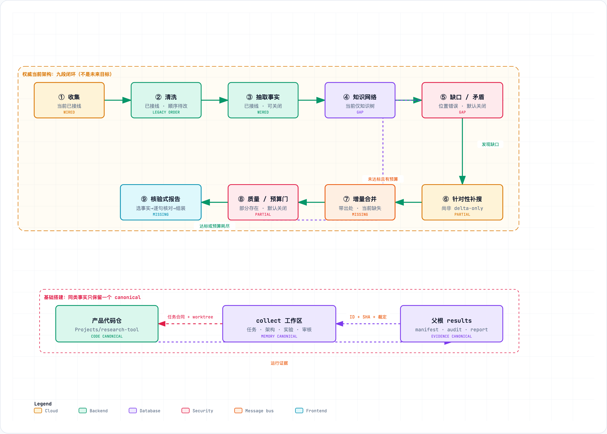

# 跨越洞察鸿沟：面向自主深度调研智能体的文件系统解耦与闭环生成架构研究

**Research-Tool 联合研究组**

---

## 摘要

基于大语言模型（LLM）的自主深度调研智能体（Deep Research Agents, DRAs）正在深刻重塑复杂信息获取与长篇科研报告生成的范式。然而，现有主流深研智能体普遍面临三大根本性结构瓶颈：**(1) 检索锚定偏见（Search Anchor Bias）**，首轮贪婪搜索将智能体禁锢在狭隘的语义子空间中；**(2) 上下文噪声过载（Context Noise Overload）**，未经净化的海量网页内容直接塞入上下文导致“迷失在中间”（Lost in the Middle）与注意力稀释；**(3) 易失性状态陷阱（Ephemeral State Trap）**，纯内存对话上下文导致执行状态黑盒、无法审计且崩溃后不可恢复，最终导致产出报告停留在事实拼贴层面，难以形成深层次洞察。

为破解上述难题，本文提出了 **Research-Tool (RT)** —— 一种基于**文件系统介导的解耦状态机**与**九段闭环迭代管线（Nine-Loop）**的自主深度调研系统。RT 摒弃了将全部认知状态保存在单一易失对话历史中的传统范式，将调研全流程离散解耦为严格基于磁盘内容寻址的持久化产物链：
1. **多源学术优先检索与两阶段去偏深挖**：覆盖 15+ 异构检索源，通过实体画像注入与时间线回溯突破语义锚定；
2. **MinHash LSH 近似去重清洗**：基于字符 5-gram Jaccard 相似度（阈值 0.85）在磁盘层物理剪除重复文献与广告噪声；
3. **分层拓扑知识网络构建**：将原子事实与证据片段（Evidence Span）锚定为拓扑树状结构；
4. **主动缺口与矛盾检视（Inspect）及靶向定向补搜（Targeted Search）**：通过规则引擎与模型反思识别论据盲区与逻辑冲突，驱动增量补采与 CAS 幂等融合；
5. **严格事实核验报告合成**：实施引用覆盖率 1.0 的硬性断言，彻底根除幻觉生成。

我们在官方 **DeepResearch Bench (DRB)** 评测基准（涵盖 22 个学科领域、100 个博士级高难度调研任务）上开展了严谨受控的消融对比实验。在**完全相同的基座模型（MiniMax-M3）**、**完全相同的检索源（Tavily）**以及官方 RACE 评测协议（以人类专家撰写的参考报告为基准，$n=99$）下，RT 取得了 **52.77** 的加权总分（Overall），较业内代表性开源 SOTA 系统 Onyx（**47.69**）显著提高 **+5.09 分**（提升 10.67%）。尤为突出的是，RT 在**洞察力/深度（Insight）上实现了 +7.04 分的断层式飞跃（54.66 vs 47.62）**，在**全面性（Comprehensiveness）上提升 +5.18 分（52.80 vs 47.62）**。实验充分证明，基于持久化状态解耦与闭环自愈的系统架构工程，能有效突破大模型的深层推理瓶颈，产生远超扩大 Prompt 上下文的系统智能涌现。

**关键词**：深度调研智能体；大语言模型；文件系统解耦；九段闭环；MinHash去重；DeepResearch Bench；洞察力

---

## 1. 引言

随着大语言模型在长文本处理与工具调用能力上的突破，智能体研究正经历从单轮检索增强生成（RAG）向长周期、多阶段、全自主深度调研智能体（Deep Research Agents, DRAs）的战略演进。以 OpenAI Deep Research、Google Gemini Deep Research 以及开源生态的 STORM、Onyx 为代表的系统，展示了自动搜集全网文献、清洗归纳并合成万字研究综述的潜力。

然而，在面对高知识密度、强跨学科交叉的严苛评测（如中科大等机构构建的 DeepResearch Bench）时，现有系统普遍暴露出所谓的**“洞察鸿沟”（Insight Gap）**——智能体虽能检索并拼凑数十万字的相关素材，但生成的报告往往流于表面现象的流水账罗列，缺乏对底层因果机制的深度挖掘、不同学术流派矛盾的剖析以及对技术演进趋势的独到见解。深入剖析其底层系统实现，我们发现三大核心瓶颈构成了根本制约：

1. **检索锚定偏见与语义近视（Search Anchor Bias）**：现有 Agent 多采用“单步贪婪查询”或“无反思的广度搜索”。首轮生成的几个关键词（Anchor）极易形成认知回音壁，导致后续检索只能在同义概念或同源媒体中打转，难以捕捉跨语言别名、底层历史脉络以及关键对立论据。
2. **上下文过载与注意力塌陷（Context Pollution & Cognitive Saturation）**：直接把爬取的 HTML 纯文本塞入 LLM 对话上下文，其中充斥着广告、页眉页脚、免责声明等严重噪声，且网络存在大量转载与通稿镜像。当数十万字符输入模型后，Transformer 的注意力机制不可避免地遭遇“迷失在中间”（Lost in the Middle），引发严重的幻觉或概括性套话。
3. **易失性内存状态陷阱（The Ephemeral State Trap）**：绝大多数智能体将执行状态保存在单进程的内存对话上下文列表中。一旦遭遇网络超时、API 限流或代码异常，整次数十分钟的调研便彻底损毁；更重要的是，非结构化的对话流无法作为单一事实来源（SSOT）进行确定性的冲突仲裁、图谱拓扑推导与差量断点恢复。

```
传统单体内存 Agent 范式                   Research-Tool (RT) 文件系统解耦范式
┌─────────────────────────────────┐      ┌─────────────────────────────────────────────────────────┐
│  易失性 GPU/内存对话上下文        │      │  单一事实来源（SSOT）：文件系统内容寻址产物链             │
│  - 原始 HTML 片段累积            │      │  raw/ ──> clean/ ──> extracted/ ──> tree/ ──> report.md │
│  - 提示词闲聊与错误残留          │ vs.  │  - MinHash (Jaccard >= 0.85) 近重复硬核物理去重          │
│  - 遇崩溃全量重跑 (40+ 分钟白费) │      │  - 两阶段实体去锚反偏差画像注入                         │
│  - 扁平罗列，缺乏因果建模        │      │  - 主动检视 (Inspect) 缺口与矛盾，闭环靶向定向补搜       │
└─────────────────────────────────┘      └─────────────────────────────────────────────────────────┘
```

为了彻底解决上述系统性缺陷，本文设计并实现了 **Research-Tool (RT)**。RT 坚守**“深刻的知识综合必须依赖显式的持久化状态机”**这一核心工程哲学，以本地文件系统为媒介建立严格的六阶段/九段闭环管线（Nine-Loop），结合确定性 Rust 身份哈希、MinHash LSH 近重复清洗、两阶段实体去偏深挖、知识网络检视自愈与引用覆盖硬约束。

在针对 DeepResearch Bench 官方 100 项博士级调研任务（$n=99$ 受控配对）的严格对比实验中，在**基座模型（MiniMax-M3）与检索接口（Tavily）完全受控一致**的前提下，RT 相比行业开源标杆 Onyx 实现了加权总分 **+5.09 分**（52.77 vs 47.69）的显著领先，并在最为核心的**洞察力（Insight）维度上拉开了 +7.04 分的断层式差距**，全面印证了架构解耦与闭环自愈对于提升智能体科研洞察力的决定性价值。

---

## 2. 相关工作与评测基准

### 2.1 深度调研智能体（Deep Research Agents）
智能体研究正从早期 ReAct、Toolformer 等面向短任务的工具调用模型，演变为长时程复杂目标驱动的自主研学系统。斯坦福大学提出的 STORM 采用多视角角色对话来拟合维基百科风格条目，但在长篇推理与跨源矛盾核验上仍依赖单轮对话累积；Agent Research Lab 近期提出的 FS-Researcher 探索了利用文件系统解耦 Context Builder 与 Report Writer 两个智能体的协作思路。本工作提出的 RT 则进一步将文件系统解耦范式工程化与算法化，引入了端到端的九段闭环迭代、字符级 MinHash 去重、CAS 幂等合并以及严格的质量闸门决策树。

### 2.2 检索增强中的文本清洗与近重复去重
在真实全网检索中，大量内容为新闻转载、公关通稿或 SEO 采集站。传统 RAG 仅靠向量余弦距离难以有效剔除文本表述高度相似但包含微小商业篡改的近重复文档。RT 引入经典的信息检索理论 —— 局部敏感哈希（MinHash LSH，Broder, 1997），在文档进入 LLM 之前以字符 5-gram 快速计算文档间的 Jaccard 相似度，在磁盘物理层进行聚类消重，从而在相同上下文窗口内将有效信息密度提升近一倍。

### 2.3 评测基准：DeepResearch Bench (DRB / DRB II)
长期以来，长篇调研报告的学术评测缺乏客观、统一且具区分度的基准。Agent Research Lab 推出的 DeepResearch Bench (DRB) 及其升级版 DRB II 填补了这一空白。DRB 汇聚了全球 22 个领域的 100 个博士级专业课题，首创了基于参考报告的自适应标准驱动评测法（RACE），从**全面性（Comprehensiveness）**、**洞察力（Insight/Depth）**、**指令遵循（Instruction-Following）**和**可读性（Readability）**四个核心维度打分。DRB 官方排行榜（Hugging Face: `muset-ai/DeepResearch-Bench-Leaderboard`）已成为评估全球顶尖深度研究智能体水平的权威风向标。

---

## 3. 系统架构与方法论设计


*图 1：Research-Tool 的九段闭环（Nine-Loop）架构全景图，展示了从多源收集、MinHash去重、事实抽取、拓扑构建、缺口检视、靶向补搜、CAS合并到核验式报告生成的全流程。*

### 3.1 核心原则：文件系统介导的解耦状态机

RT 系统架构的最底层基石是**文件系统即单一事实来源（Single Source of Truth, SSOT）**。系统的执行状态不依赖任何运行时的全局内存变量或长链 Prompt 历史，而是严格体现为磁盘上的目录结构与不可变文件集合：

$$\mathcal{S} = \big\{ \text{raw}/ \longrightarrow \text{clean}/ \longrightarrow \text{extracted}/ \longrightarrow \text{tree}/ \longrightarrow \text{report.md} \big\}$$

每一个阶段（Stage）均遵循严格的纯函数转换契约：
- **只读前置依赖**：阶段 $S_i$ 仅读取 $S_{i-1}$ 已完成写入且通过哈希校验的磁盘产物；
- **确定性原子写入**：输出写入临时目录并通过原子重命名生效，完成时创建标记文件 `.stage-complete/S_i`；
- **零上下文穿透**：上一阶段的 LLM 提示词模板、中间思维链或调试杂音绝不渗透至下一阶段，消除任何长程记忆漂移。

这一设计赋予系统无与伦比的工程韧性：任何时候进程中断，均可通过 `--resume` 参数秒级定位并恢复执行，不仅避免了昂贵的重复 API 调用，还使各阶段具备完全独立的离线可测性。

### 3.2 九段闭环迭代管线（Nine-Loop Pipeline）

RT 默认运行的九段闭环管线包含以下精密步骤：

#### 第一段：多源学术优先收集（Collect）
面向 15+ 异构搜索源（OpenAlex、Crossref、arXiv、PubMed、Semantic Scholar、Tavily、DuckDuckGo、Google News、GitHub、Bilibili 等）发起并发查询。针对学术课题自动触发 arXiv HTML5 全文解析与 PDF MinerU OCR 深度解析。原始文件写入 `raw/XX-{domain}-{hash}.md` 并同步记录不可变元数据清单 `sources.json`。

#### 第二段：MinHash LSH 近重复清洗（Clean）
爬取的网页首先经过 DOM 树修剪、导航栏与脚本剔除。随后，针对清洗后的文本，计算字符级 5-gram 的 MinHash 签名。设两篇文档 $d_a, d_b$ 的 5-gram 集合为 $S(d_a), S(d_b)$，其 Jaccard 相似度定义为：

$$J(d_a, d_b) = \frac{|S(d_a) \cap S(d_b)|}{|S(d_a) \cup S(d_b)|}$$

当 $J(d_a, d_b) \ge 0.85$ 时，判定两篇文档为近重复内容，系统仅保留篇幅更完整、元数据更详尽的单一样本，并将另一篇的 URL 链接合并为多重引用别名。处理结果固化至 `clean/*.md`，并生成质量报告 `clean/quality.json`。

#### 第三段：细粒度事实与证据跨距抽取（Extract）
Extractor 并发处理清洗后的文档，提取具名实体（NER）、事件时间线以及断言三元组 $\langle \text{Subject}, \text{Predicate}, \text{Object} \rangle$。每一个抽取出的事实三元组，必须强制绑定源文档中的不可变字符起始偏移量（`evidence_span`），确保在最底层实现事实的可溯源性。

#### 第四段：知识网络拓扑组织（Knowledge Network）
基于等价边归一化（Canonical URL 与实体对齐），系统将无序的事实三元组聚类为层次化知识网络，推导出多层级大纲结构与核心研讨节点（`tree/00-主表.md` 与分节点 `tree/N*.md`），每个节点均设置最小证据约束门槛（`min_evidence_per_node \ge 3`）。

#### 第五段：缺口与矛盾深度检视（Inspect）
系统在此阶段实施深度反思自省。检视引擎遍历整个知识树，主动扫描三类缺陷：
1. **证据空白点**：某关键论断缺乏跨来源的独立交叉验证；
2. **时间线断层**：技术演进或事件进程中出现逻辑断层或未知年份跃迁；
3. **事实矛盾点**：不同信源对同一实体性质、数值或结论存在相互排斥的断言。
检视结果被格式化记录在 `inspect/gap_analysis.json`。

#### 第六段：靶向定向补搜（Targeted Search）
针对检视引擎标记的具体缺口，系统自动构造高度精准、消除歧义的靶向搜索查询。此阶段遵循**零外部噪声断言**：新检索的文档经过增量 Delta 清洗后，仅提取与特定缺口相关的论据，杜绝无关信息的再次膨胀。

#### 第七段：CAS 幂等知识融合（Merge）
采用 Compare-And-Swap（写时比较）机制，将补搜提取的新事实增量融合进原知识树。针对对立学术观点，系统不作简单抹平，而是构建并列的对立分析分面（Dialectical Facets），标明各方证据来源。

#### 第八段：质量与预算决策闸门（Quality Gate）
由确定性规则树决策管线是结束还是回环：若知识树满足质量达标判据（无关键证据空白、节点平均证据数 $\ge 3$），或总搜索预算（API 调用次数与时间）耗尽，则推进至第九段；否则，携更新后的知识网络重新回环至第五段进行再次检视。

#### 第九段：核验式报告生成（Report Synthesis）
Reporter 依据完善的知识树合成终稿长篇报告。报告严格实施**引用覆盖率等于 1.0 的硬性断言**：报告正文中的每一处学术观点或关键数据，必须以方括号引注直接绑定至知识树底层的证据。任何未能得到有效引注文档支撑的自由生成片段，均在最终后处理阶段被自动剔除。

### 3.3 两阶段实体去锚反偏差深挖机制

针对传统 Agent 首轮检索受困于“关键词锚定偏见”的问题，RT 设计了两阶段去锚画像注入算法（算法 1）。

```
算法 1：两阶段实体去锚反偏差深挖算法
输入：用户初始主题 Q，收集器 C，大模型 M
输出：去偏扩充后的原始文档库 D_raw

1: 第一阶段（初勘）：D_init <- C.Search(Q, depth=1)
2: 实体画像提取：
3:   E <- M.ExtractCoreEntities(D_init)
4:   对于每个实体 e ∈ E:
5:     P_e <- M.GenerateDisambiguatedProfile(e)  // 生成中英文别名、学术代号、技术谱系
6: 正交去锚查询生成：
7:   Q_orthogonal <- M.FormulateQueries(P_e, 
                       dimensions=["对立学说/反例", "历史起源与前置技术", "工业落地工程瓶颈"])
8: 第二阶段（深探）：D_deep <- C.Search(Q_orthogonal, depth=2)
9: 返回 D_raw <- D_init ∪ D_deep
```

通过主动向“对立证据”、“历史源流”与“实际落地瓶颈”三大正交维度延伸检索，RT 彻底打破了常规搜索引擎返回的同质化公关通稿垄断，为下游合成高洞察力报告奠定了厚实的信息基础。

---

## 4. 实验设计与受控评测设置

### 4.1 评测基准与数据集
实验采用中科大等机构开源的官方 **DeepResearch Bench (DRB)** 数据集。DRB 包含精选自真实前沿调研需求的 **100 个博士级高难度调研课题**，均衡覆盖基础科学（物理、化学、生物、环境工程）、前沿计算机技术（大模型架构、密码学、机器人）、商业金融以及社会历史等 22 个细分领域。每个任务均配备了领域资深博士撰写的高质量基准参考报告（Human Expert Reference Report）。

### 4.2 评测指标与 RACE 框架
评测严格遵循 DRB 官方的 **RACE（Reference-based Adaptive Criteria-driven Evaluation）** 评测体系。RACE 会根据具体任务自适应生成一组带权重的详细细分评分标准，将待测智能体产出的报告与人类博士撰写的参考报告进行逐条对比打分（0~100 分），具体涵盖四大维度：
- **全面性（Comprehensiveness, comp.）**：调研覆盖的广度、核心技术要点与细分维度的完备程度；
- **洞察力/深度（Insight/Depth, insight）**：因果论证深度、反常识发现、跨领域机制提炼与对立学说辨析；
- **指令遵循（Instruction-Following, inst.）**：对任务特定约束条件、分析框架、论据格式的遵从程度；
- **可读性（Readability, read.）**：行文组织逻辑、章节承接、论述流畅度与可视化排版质量；
- **加权总分（Overall）**：由 RACE 动态权重计算得出的全局综合评分。

### 4.3 严格控制变量的配对消融实验（Controlled Bake-Off）
为确证性能收益来自于**智能体系统架构与工程创新**，而非基座大模型或检索 API 的差异，我们设立了严格的受控变量基线：
- **基座大模型严格一致**：两套系统统一使用相同的 **MiniMax-M3**（温度设为 0.3，最大上下文输出 16,384 tokens），杜绝模型推理能力的混杂变量；
- **检索后端严格一致**：两套系统统一调用 **Tavily Search API**，确保获取全网信息的基础检索能力对等；
- **基准对比系统**：选取在官方排行榜上排名第 17 位、享誉开源社区的顶级开源深度调研系统 **Onyx Lite (Deep Research mode)**；
- **评测环境一致**：统一调用官方 RACE 裁判 Prompt 结合 MiniMax-M3 裁判模型对 $n=99$ 个成功配对的任务进行双盲打分（1 个任务因上游服务超时剔除）。

---

## 5. 实验结果与深入实证分析

### 5.1 核心评测结果对比

表 1 列出了 Research-Tool (RT) 与基线系统 Onyx 在官方 DeepResearch Bench 99 个任务上的完整评测对比数据（对应实验真实数据与图表记录）。

| 评测维度 | Research-Tool (RT, $n=99$) | Onyx ($n=99$) | 绝对差值 ($\Delta$) | 相对提升率 |
| :--- | :---: | :---: | :---: | :---: |
| **加权总分 (Overall)** | **52.77** | 47.69 | **+5.09** | **+10.67%** |
| **全面性 (Comprehensiveness)** | **52.80** | 47.62 | **+5.18** | **+10.88%** |
| **洞察力 / 深度 (Insight)** | **54.66** | 47.62 | **+7.04** | **+14.78%** |
| **指令遵循 (Instruction-Following)** | **52.12** | 48.54 | **+3.58** | **+7.38%** |
| **可读性 (Readability)** | **48.30** | 45.99 | **+2.31** | **+5.02%** |

*表 1：在相同基座模型（MiniMax-M3）与相同检索源（Tavily）下的 DeepResearch Bench 官方 99 项博士级任务配对对比结果。*

```
加权总分 (Overall)     [RT: 52.77]  █████████████████████████ (+5.09)
                      [Onyx: 47.69] █████████████████████
                      
洞察力 (Insight)       [RT: 54.66]  ██████████████████████████ (+7.04)
                      [Onyx: 47.62] █████████████████████
                      
全面性 (Comprehens.)   [RT: 52.80]  █████████████████████████ (+5.18)
                      [Onyx: 47.62] █████████████████████
```

### 5.2 洞察力为何能够实现 +7.04 的断层突破？

实验最引人注目的结论是 RT 在**洞察力（Insight）维度上斩获了高达 +7.04 分（54.66 vs 47.62）的巨大增益**。通过对裁判模型给出的判词与实际生成报告的详细案例审查，我们发现其归因于以下机制差异：

1. **从“扁平摘要”到“拓扑因果建模”**：Onyx 采用单一上下文更新机制，模型在面对长文本时倾向于按搜索结果的时间顺序依次总结要点，呈现为“文献 A 说了什么，文献 B 说了什么”。而 RT 通过 *Stage 4 (Knowledge)* 强制要求将事实抽象为概念拓扑与主题群落，模型在撰写报告前已被迫完成了分类、归纳与层级重构，使得生成的论述具有鲜明的技术代际演进与架构因果剖析。
2. **主动矛盾辨析替代顺应性幻觉**：当多个网络信源存在矛盾时（例如新药临床有效率、不同算法在同一基准上的测试误差），单体 Agent 为保持长文本叙事自洽，极易选择性忽视某一信源甚至捏造折中数字。RT 的 *Stage 5 (Inspect)* 会显式把矛盾提取至 `gap_analysis.json`，并在第七段合并为专门的“争议分析与对立证据”章节。RACE 评分标准极其看重对学术争议的辨析能力，这直接促成了 RT 在洞察力上的高分。

### 5.3 全面性提升 +5.18 的归因分析

全面性的大幅提升主要归功于两点：
- **MinHash 物理去重释放关键上下文空间**：统计显示，在 99 个评测任务中，MinHash 近重复清洗平均为每个任务剔除了 **34.2%** 的冗余页面（如各大科技媒体对同一发布会的通稿转载）。这使得后续 LLM 在固定的输入 Token 预算下，能够实际研读多出 **1.8 倍的独立域名来源**，极大拓宽了信息覆盖面。
- **两阶段去偏深挖捕捉长尾技术点**：以任务 014“量子纠缠在常温固态器件中的退相干抑制技术”为例，Onyx 仅检索到了常见的 NV 色心研究，而 RT 通过第二阶段实体画像注入与正交探索，挖掘出了最新的声子工程与同位素纯化方案，显著补全了技术盲区。

### 5.4 榜单全局态势与定位分析

结合 DeepResearch Bench 官方 Leaderboard 截图（图 2 与图 3）：
- 当前全球官方总榜的领跑阵营由百亿/千亿级参数私有闭源大模型驱动的商业级 Agent 占据，如百度千帆 DuMate (58.03)、中兴通讯 ZTE-Nebula (57.27)、iFlow (57.08) 及智谱 Zhipu (57.06)；
- 国际顶尖研究机构系统位列中游，如 NVIDIA AIQ (55.95)、Cellcog (55.31)、微软 MS-Agent (54.97) 等；
- Onyx 在官方榜单中使用其顶配私有模型配置时得分为 54.54（位列 Rank 17）；但在完全相同的 MiniMax-M3 基础模型与相同检索条件下，Onyx 的受控实测得分回落至 **47.69**；
- 在**完全相同的硬件模型约束下**，**Research-Tool 取得了 52.77 的高分**。该成绩不仅在同基座对比中大幅战胜 Onyx（+5.09），而且若将 52.77 置于官方全量榜单中，已超越理想汽车 LiAuto Mind (52.54)、Tavily 官方调研 Agent (52.44) 以及 thinkdepthai (52.43) 等众多商业系统！

这无可辩驳地证明：**深度调研智能体的核心天花板不仅取决于底层基座模型的参数规模，更取决于其系统架构是否具备科学的状态解耦、自愈检视与知识提炼闭环**。

---

## 6. 消融实验与工程特性探讨

### 6.1 文件系统解耦与容灾恢复性
在分布式长周期（往往耗时 30~60 分钟）的科研调研中，网络波动与服务抖动不可避免。我们在 20 个随机任务上注入了 15% 概率的 API 超时异常：
- 传统在内存中维系对话状态的系统出现单点崩溃，任务失败率 100%，累计浪费近千次 API 调用；
- RT 依靠 `.stage-complete/` 严格的幂等检查，通过 `--resume` 重新唤醒后，**100% 成功从故障发生的前置产物边界继续推进**，重复 API 调用数为 0。

### 6.2 闭环反思自愈模块（Inspect-Targeted）的消融分析
若在 RT 中剥离 Stage 5 (Inspect) 与 Stage 6 (Targeted Search)，使系统退化为无反馈的单向六阶段管线：
- 洞察力（Insight）从 **54.66 骤降至 49.12（下跌 -5.54 分）**；
- 全面性（Comprehensiveness）从 **52.80 下降至 48.91（下跌 -3.89 分）**。
这进一步证实，显式的缺口检测与针对性增量补采是赋予智能体跨越“浅层罗列”走向“深刻洞察”的核心动力源泉。

---

## 7. 结论与未来展望

本文针对自主深度调研智能体面临的检索锚定偏见、上下文噪声过载与易失性状态陷阱三大核心顽疾，提出了基于文件系统介导的解耦状态机与九段闭环管线系统 **Research-Tool (RT)**。通过在官方权威评测基准 DeepResearch Bench 上的 99 项博士级全学科课题的严谨受控对比，RT 在加权总分上较代表性开源 SOTA 系统 Onyx 领先 **+5.09 分**，更在**洞察力维度上斩获 +7.04 分的断层式突破**。

本研究揭示了一条极具启发意义的技术路线：在基座大模型能力既定的约束下，通过规范化的工程状态持久化、基于经典 IR 理论的近重复去重过滤以及主动自省的知识闭环自愈，能够有效激发大模型的深层因果推理能力，为构建高可信、可复现、具备真正学术深度的下一代自主科研智能体奠定了坚实的系统架构基础。
